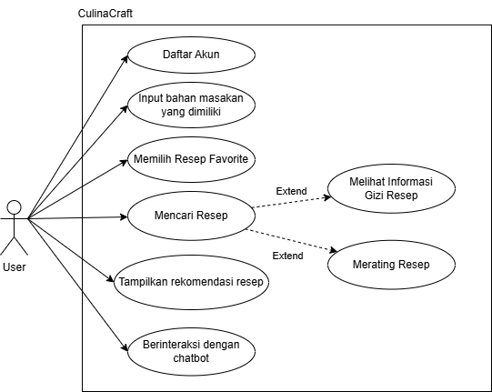
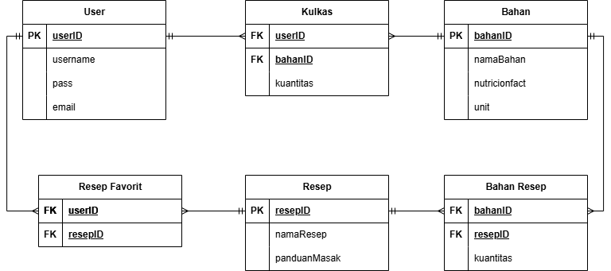
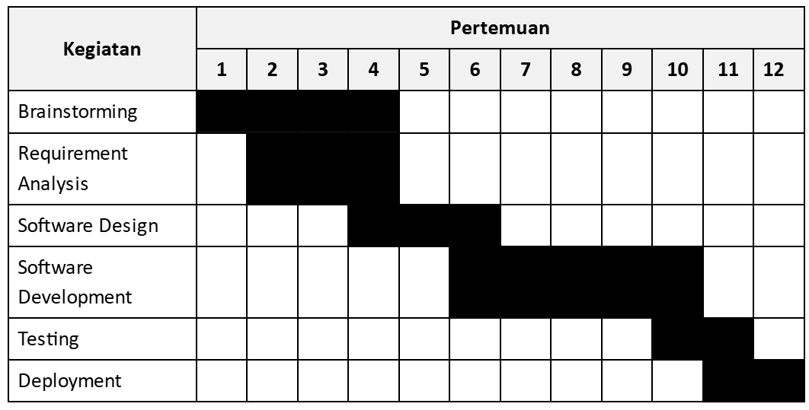

# Jin Masak

- Ketua Kelompok: Eduardus Bagus Wicaksono - 22/493128/TK/53996
- Anggota 1: Salwa Nayla Adistri - 22/493200/TK/54017
- Anggota 2: Nabila Puspita Dewi - 22/493935/TK/54142

## Project Senior TI

## Departemen Teknik Elektro dan Teknologi Informasi, Fakultas Teknik, Universitas Gadjah Mada

## Nama Produk
**CulinaCraft**

## Jenis Produk
Aplikasi web dan mobile berbasis kecerdasan buatan (AI) yang menyediakan rekomendasi resep masakan yang dipersonalisasi sesuai dengan preferensi pengguna, serta membantu mengurangi pemborosan makanan dan mengatur pola makan sehat.

## Latar Belakang
Perkembangan teknologi memungkinkan masyarakat untuk mengakses informasi dengan lebih cepat dan mudah, termasuk dalam dunia kuliner. Di Indonesia, terdapat masalah signifikan terkait food loss and waste (FLW), dengan estimasi 23-48 juta ton makanan terbuang setiap tahunnya. Survei menunjukkan bahwa banyak orang memasak di rumah untuk menghemat biaya dan mengatur kesehatan mereka. Namun, banyak platform resep yang tersedia saat ini tidak memiliki fitur personalisasi berdasarkan preferensi pengguna. Oleh karena itu, kami merancang CulinaCraft untuk mengatasi masalah tersebut, mengurangi pemborosan makanan, dan memberikan solusi yang sehat melalui teknologi AI dan cloud computing.

## Ide dan Solusi
CulinaCraft menggunakan AI dan machine learning untuk memberikan rekomendasi resep yang disesuaikan dengan bahan yang tersedia di rumah pengguna, preferensi diet, dan tujuan kesehatan mereka. Aplikasi ini juga dilengkapi dengan fitur seperti chatbot berbasis AI yang memberikan panduan langkah demi langkah dalam memasak dan calorie tracker yang membantu pengguna memantau asupan kalori.

### Rancangan Fitur
1. **Calorie Tracker**: Memantau kesehatan pengguna berdasarkan makanan yang dimasak, dengan informasi kalori masakan.
2. **Rekomendasi Resep**: Menyajikan resep yang disesuaikan dengan bahan yang dimiliki pengguna dan preferensi diet mereka.
3. **Chatbot Assistant**: Menyediakan bantuan langsung selama proses memasak jika pengguna membutuhkan panduan langkah tertentu.

## Analisis Kompetitor

### 1. Cookpad
- **Jenis Produk**: Aplikasi untuk berbagi resep masakan dengan komunitas pengguna.
- **Kelebihan**: Komunitas aktif, berbagai resep dari berbagai budaya, pencarian resep yang kuat.
- **Kekurangan**: Kurangnya fokus pada informasi gizi dan personalisasi resep.
- **Keunggulan Kompetitif**: Komunitas besar yang memungkinkan berbagi resep, pengalaman, dan tips.

### 2. Yummly
- **Jenis Produk**: Aplikasi untuk resep masakan dengan personalisasi berdasarkan diet dan alergi makanan.
- **Kelebihan**: Personalisasi resep, informasi gizi yang lengkap, rekomendasi resep berdasarkan bahan.
- **Kekurangan**: Kurangnya interaksi sosial, dan tidak ada rekomendasi berdasarkan analisis kesehatan individu.
- **Keunggulan Kompetitif**: Personalisasi berdasarkan diet dan alergi, fitur daftar belanja otomatis, integrasi dengan layanan pengiriman bahan makanan.

### 3. MyFitnessPal
- **Jenis Produk**: Aplikasi untuk pelacakan kalori dan manajemen nutrisi.
- **Kelebihan**: Database makanan yang luas, pelacakan kalori dan makronutrien yang detail, integrasi dengan perangkat lain.
- **Kekurangan**: Fokus pada pelacakan kalori daripada edukasi memasak, kurangnya rekomendasi resep.
- **Keunggulan Kompetitif**: Pelacakan kalori dan nutrisi yang sangat detail, integrasi perangkat kebugaran, komunitas dukungan.

## Metodologi
Metodologi yang digunakan adalah metodologi agile dengan framework Kanban. Metodologi Agile cocok untuk projek ini karena proses pengembangan projek akan beriterasi dan terus mengalami perubahan pada tiap prosesnya. Agile didukung dengan framework kanban yang berfokus pada visualisasi alur kerja dan pembatasan workload yang sedang berlangsung sehingga progres proyek dapat terpantau secara real-time. Dengan menggunakan kanban pada proyek ini maka pengerjaan proyek dapat lebih fleksibel dikarenakan tim dapat terus mengembangkan dan merilis fitur tanpa perlu menunggu akhir iterasi, mengurangi bottleneck dikarenakan kanban membatasi jumlah tugas pada waktu yang bersamaan, dan memudahkan koordinasi antar anggota tim. 

## Tujuan Produk
Produk ini bertujuan untuk membantu pengguna dalam hal memasak, seperti mencari resep-resep baru, mempelajari ilmu dasar dalam memasak, memanfaatkan bahan-bahan yang ada di rumah untuk meminimalisir food waste, dan mendampingi pengguna dalam proses memasak dari awal hingga akhir.

## Pengguna Potensial
- Ibu-ibu rumah tangga: Ibu-ibu rumah tangga membutuhkan ide-ide masakan baru untuk menciptakan variasi menu di rumah dan ibu-ibu rumah tangga juga butuh untuk meningkatkan kemampuan memasak dengan melihat bahan-bahan pendukung atau teknik baru untuk meningkatkan cita rasa makanan.
- Pemula dalam memasak: Pemula membutuhkan ajaran terkait dasar-dasar memasak dan resep-resep simpel. Pemula umumnya memiliki banyak pertanyaan saat sedang proses memasak sehingga butuh media yang dapat menjawab pertanyaan-pertanyaan tersebut.

## Use Case Diagram

## Functional Requirements

### 1. Manajemen Pengguna
- Pengguna dapat membuat akun baru dengan email dan kata sandi
- Pengguna dapat login menggunakan email dan kata sandi
- Pengguna dapat memperbarui profil dan resep favorit
  
### 2. Rekomendasi Resep Berbasis AI/ML
- Pengguna dapat memasukkan bahan-bahan yang tersedia untuk dimasak dan sistem dapat menyimpan input untuk memberikan rekomendasi resep
- Sistem memberikan rekomendasi resep berdasarkan preferensi, riwayat, dan bahan yang dimiliki pengguna yang didapatkan melalui algoritma AI/ML
- Pengguna dapat mencari resep berdasarkan kategori dan sistem dapat menampilkan resep yang sesuai
- Pengguna dapat melihat detail dari suatu resep, seperti bahan-bahan, alat-alat, langkah-langkah, waktu persiapan dan memasak, serta informasi kalori
  
### 3. Chatbot AI sebagai Asisten
- Chatbot AI dapat memberi panduan memasak lebih detail dan menjawab pertanyaan spesifik terkait suatu resep
  
### 4. Manajemen Bahan dan Resep
- Pengguna dapat menyimpan bahan-bahan yang dimiliki untuk memasak sehingga sistem juga dapat memberikan rekomendasi seputar bahan tersebut.
- Pengguna dapat menyimpan resep favorit untuk dimasak ulang di kemudian hari.
- Pengguna dapat melihat riwayat pencarian resep yang telah disimpan oleh sistem

### 5. Dashboard Personalisasi
- Setelah login, pengguna dapat melihat dashboard personalisasi yang berisi rekomendasi resep dengan preferensi terbaru, resep favorit, dan riwayat resep.

## Entity Relation Diagram

## Low Fidelity Wireframe

## Gantt Chart

